# Student Management System

Dự án quản lý sinh viên sử dụng Java Spring Boot, Thymeleaf và PostgreSQL. Đây là bài tập thực hành tổng hợp từ Lab 1 đến Lab 5 môn Công nghệ Phần mềm Nâng cao.

## 1. Thành Viên Nhóm

| STT | Họ và Tên    | MSSV    |
| --- | ------------ | ------- |
| 1   | Cấn Hoàng Hà | 2310836 |

## 2. Public URL (Deployment)

Ứng dụng đã được triển khai thành công trên Render:

- **Website:** https://student-management-9qhv.onrender.com/
- **Database:** Neon.tech (PostgreSQL)

## 3. Hướng Dẫn Cài Đặt & Chạy Dự Án (Local)

### Yêu cầu hệ thống

- Java JDK 17 hoặc 21
- Maven
- PostgreSQL

### Các bước thực hiện

**Bước 1: Clone dự án về máy**

```bash
git clone https://github.com/CanHoangHa/student-management.git
cd student-management
```

**Bước 2: Cấu hình biến môi trường**

#### **Dự án đã được cấu hình mặc định để chạy trên máy cá nhân (Localhost). Nếu chạy Local:**

Bạn không cần tạo file `.env` nếu Database local của bạn dùng:

- **Port:** 5432
- **User:** postgres
- **Password:** password

#### **Nếu Deploy (hoặc Database khác mặc định):**

Tạo file `.env` tại thư mục gốc để ghi đè cấu hình mặc định:

```properties
# Điền thông tin database thực tế của bạn vào đây
DATABASE_URL=jdbc:postgresql://<HOST_CUA_BAN>:<PORT>/<TEN_DB>?sslmode=require
DB_USERNAME=<TEN_DANG_NHAP>
DB_PASSWORD=<MAT_KHAU>
```

**Bước 3: Chạy ứng dụng**

Tại thư mục gốc của dự án, chạy lệnh sau để tự động tải thư viện và khởi động:

```bash
./mvnw spring-boot:run
```

Sau khi ứng dụng khởi động thành công, truy cập trình duyệt tại địa chỉ:
http://localhost:8080/students

## 4. Trả Lời Câu Hỏi Lý Thuyết (Lab 1)

### Câu 1: Ràng buộc Khóa Chính (Primary Key)

**Câu hỏi:** Tại sao khi Insert một sinh viên có ID trùng với người đã có sẵn thì Database báo lỗi UNIQUE constraint failed?

**Trả lời:** Trong Lab 1, bảng `students` được tạo với cột `id` là khóa chính (`INTEGER PRIMARY KEY`). Thuộc tính cơ bản của Khóa Chính là tính duy nhất (Unique) để định danh từng bản ghi. Do đó, khi cố tình chèn trùng ID, hệ quản trị CSDL SQLite sẽ chặn lại và báo lỗi để đảm bảo tính toàn vẹn của dữ liệu.

### Câu 2: Toàn vẹn dữ liệu (Constraints)

**Câu hỏi:** Thử Insert một sinh viên nhưng bỏ trống cột `name` (để NULL). Database có báo lỗi không? Từ đó suy nghĩ xem sự thiếu chặt chẽ này ảnh hưởng gì khi code Java đọc dữ liệu lên?

**Trả lời:**

Database **KHÔNG** báo lỗi. Lý do là trong câu lệnh tạo bảng của Lab 1 (`CREATE TABLE IF NOT EXISTS students...`), cột `name` chỉ được khai báo là `TEXT` mà không có ràng buộc `NOT NULL`. Do đó, SQLite vẫn chấp nhận giá trị `NULL`.

**Ảnh hưởng:** Khi code Java đọc dữ liệu này lên, thuộc tính `name` của đối tượng `Student` sẽ nhận giá trị `null`. Nếu ứng dụng không kiểm tra kỹ (null check), việc gọi các phương thức xử lý chuỗi (như `.length()`, `.equals()`) trên biến này sẽ gây ra lỗi `NullPointerException`, làm ứng dụng bị crash.

### Câu 3: Cấu hình Hibernate

**Câu hỏi:** Tại sao mỗi lần tắt ứng dụng và chạy lại, dữ liệu cũ trong Database lại bị mất hết?

**Trả lời:** Do trong file `application.properties` của Lab 1, cấu hình được đặt là `spring.jpa.hibernate.ddl-auto=create`. Giá trị `create` yêu cầu Hibernate xóa bỏ (drop) các bảng cũ và tạo lại (create) bảng mới hoàn toàn mỗi khi khởi động ứng dụng, dẫn đến việc mất toàn bộ dữ liệu đã lưu trước đó.

## 5. Screenshots (Lab 4 - Final Product)

### 5.1. Trang Danh Sách Sinh Viên

- **URL:** `/students`
- **Yêu cầu giao diện:**
  - Hiển thị danh sách toàn bộ sinh viên dưới dạng bảng.
  - Tích hợp ô nhập liệu để tìm kiếm sinh viên theo tên.
  - Nút "Thêm Mới" để điều hướng sang trang tạo sinh viên.
  - Mỗi dòng dữ liệu cần có liên kết hoặc nút "Xem Chi Tiết".

<p align="center">
  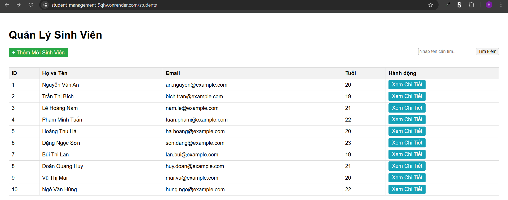
  <br>
  <i>Hình 1: Danh Sách Sinh Viên</i>
</p>
<p align="center">
  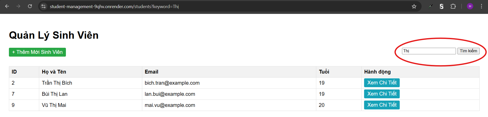
  <br>
  <i>Hình 2: Tìm Kiếm Sinh Viên có chữ Thị trong tên</i>
</p>

### 5.2. Trang Chi Tiết Sinh Viên

- **URL:** `/students/{id}`
- **Yêu cầu giao diện:**
  - Hiển thị đầy đủ thông tin chi tiết của sinh viên (ID, Tên, Email, Tuổi).
  - Nút "Chỉnh Sửa" để điều hướng sang trang cập nhật thông tin.
  - Nút "Xóa":
    - Yêu cầu xác nhận (Confirm Dialog) trước khi thực hiện xóa.
    - Sau khi xóa thành công, điều hướng về Trang Danh Sách.

<p align="center">
  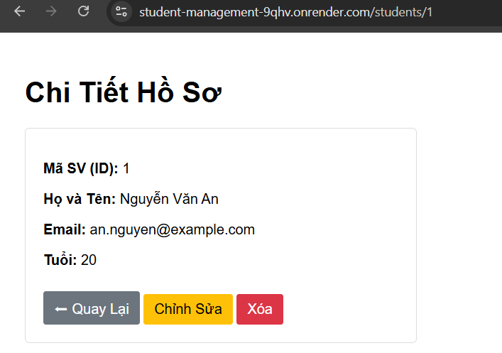
  <br>
  <i>Hình 3: Chi Tiết Sinh Viên</i>
</p>

### 5.3. Chức Năng Thêm Mới

- **Yêu cầu giao diện:**
  - Form nhập liệu (Tên, Email, Tuổi).
  - Sau khi lưu thành công → Quay về Trang Danh Sách.

<p align="center">
  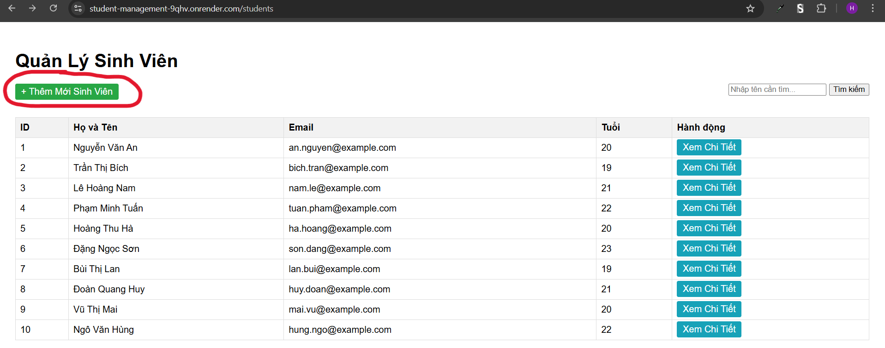
  <br>
  <i>Hình 4: Nút Thêm Mới</i>
</p>
<p align="center">
  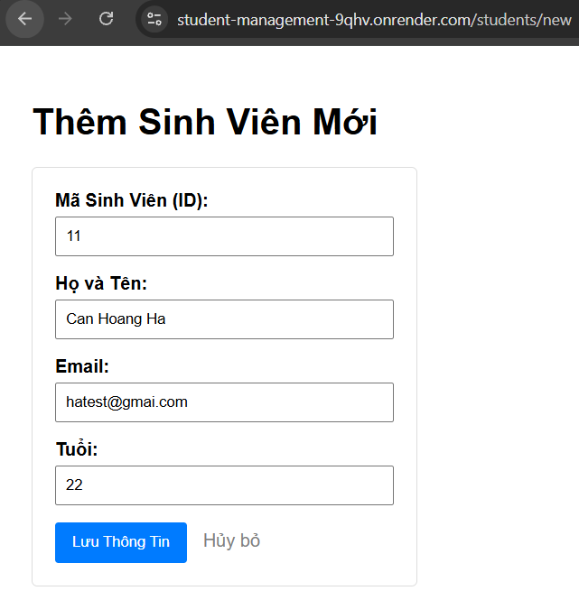
  <br>
  <i>Hình 5: Thêm Mới Sinh Viên</i>
</p>
<p align="center">
  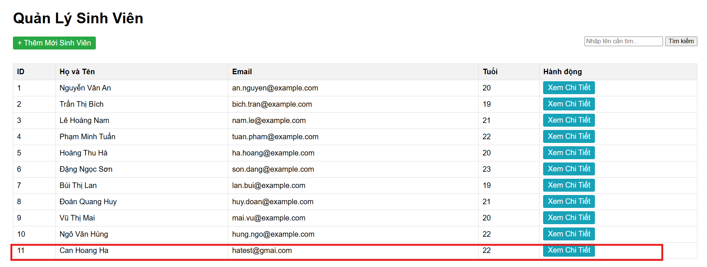
  <br>
  <i>Hình 6: Thêm Mới Thành Công</i>
</p>

### 5.4. Chức Năng Chỉnh Sửa

- **Yêu cầu giao diện:**
  - Form nhập liệu (như Thêm Mới) nhưng đã điền sẵn thông tin cũ.
  - Sau khi lưu thành công → Quay về Trang Danh Sách (hoặc trang chi tiết).

<p align="center">
  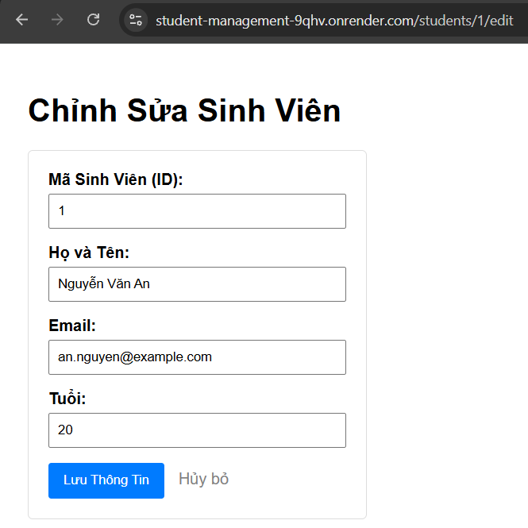
  <br>
  <i>Hình 7: Trước Chỉnh Sửa</i>
</p>
<p align="center">
  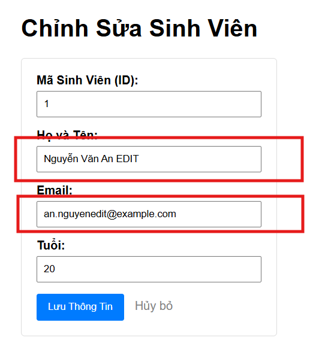
  <br>
  <i>Hình 8: Chỉnh Sửa</i>
</p>
<p align="center">
  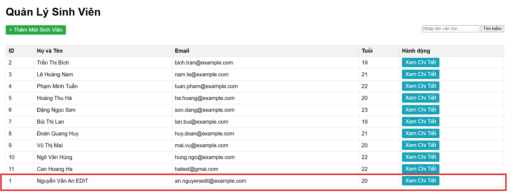
  <br>
  <i>Hình 9: Chỉnh Sửa Thành Công</i>
</p>

### 5.5. Chức Năng Xóa

- **Yêu cầu giao diện:**
  - Hộp thoại xác nhận xóa.

<p align="center">
  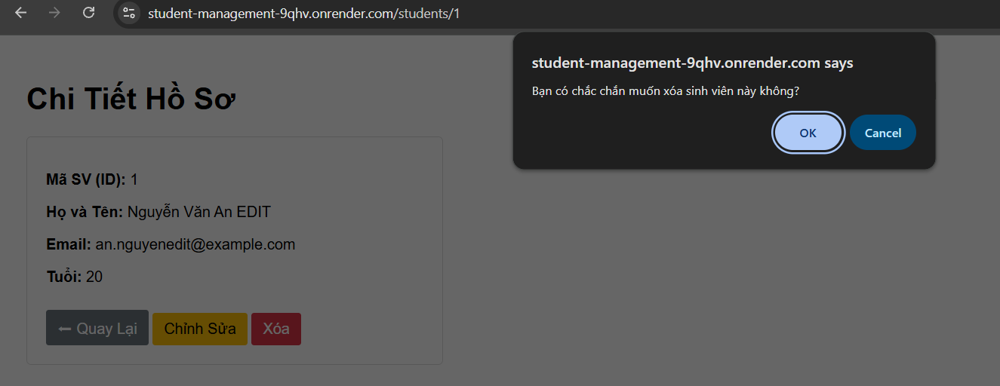
  <br>
  <i>Hình 10: Xóa Sinh Viên (ID 1)</i>
</p>
<p align="center">
  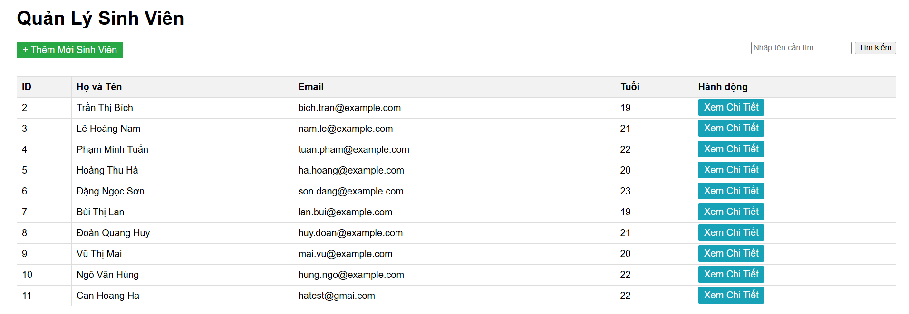
  <br>
  <i>Hình 11: Xóa Thành Công (Không còn sinh viên ID 1)</i>
</p>
